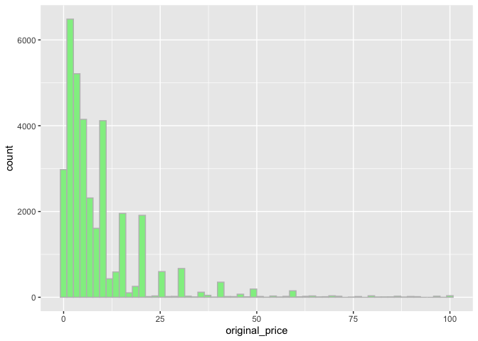
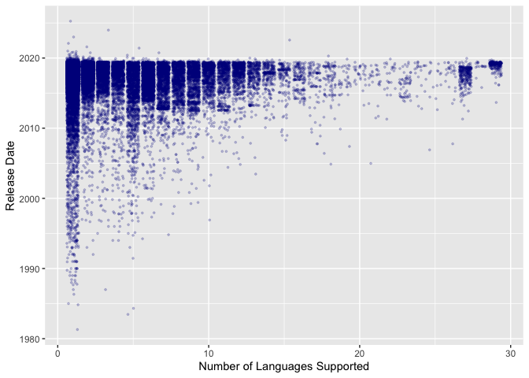
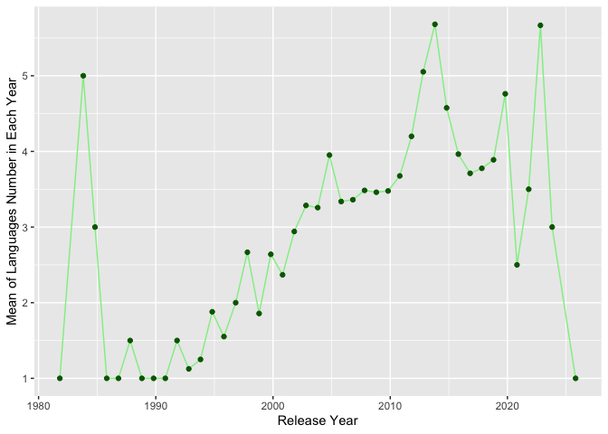
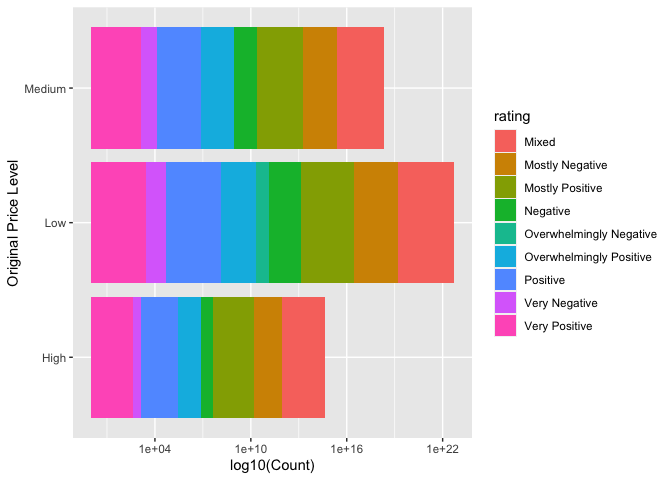
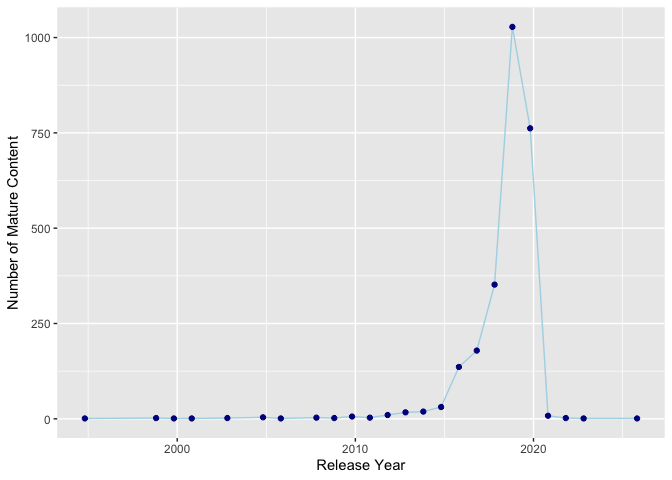
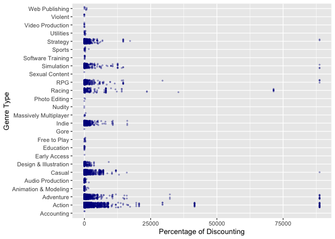

Mini Data-Analysis Deliverable 1
================

# Welcome to your (maybe) first-ever data analysis project!

And hopefully the first of many. Let’s get started:

1.  Install the [`datateachr`](https://github.com/UBC-MDS/datateachr)
    package by typing the following into your **R terminal**:

<!-- -->

    install.packages("devtools")
    devtools::install_github("UBC-MDS/datateachr")

2.  Load the packages below.

``` r
library(datateachr)
library(tidyverse)
```

    ## ── Attaching packages ─────────────────────────────────────── tidyverse 1.3.2 ──
    ## ✔ ggplot2 3.3.6      ✔ purrr   0.3.4 
    ## ✔ tibble  3.1.8      ✔ dplyr   1.0.10
    ## ✔ tidyr   1.2.1      ✔ stringr 1.4.1 
    ## ✔ readr   2.1.2      ✔ forcats 0.5.2 
    ## ── Conflicts ────────────────────────────────────────── tidyverse_conflicts() ──
    ## ✖ dplyr::filter() masks stats::filter()
    ## ✖ dplyr::lag()    masks stats::lag()

3.  Make a repository in the <https://github.com/stat545ubc-2022>
    Organization. You will be working with this repository for the
    entire data analysis project. You can either make it public, or make
    it private and add the TA’s and Lucy as collaborators. A link to
    help you create a private repository is available on the
    \#collaborative-project Slack channel.

# Instructions

## For Both Milestones

-   Each milestone is worth 45 points. The number of points allocated to
    each task will be annotated within each deliverable. Tasks that are
    more challenging will often be allocated more points.

-   10 points will be allocated to the reproducibility, cleanliness, and
    coherence of the overall analysis. While the two milestones will be
    submitted as independent deliverables, the analysis itself is a
    continuum - think of it as two chapters to a story. Each chapter, or
    in this case, portion of your analysis, should be easily followed
    through by someone unfamiliar with the content.
    [Here](https://swcarpentry.github.io/r-novice-inflammation/06-best-practices-R/)
    is a good resource for what constitutes “good code”. Learning good
    coding practices early in your career will save you hassle later on!

## For Milestone 1

**To complete this milestone**, edit [this very `.Rmd`
file](https://raw.githubusercontent.com/UBC-STAT/stat545.stat.ubc.ca/master/content/mini-project/mini-project-1.Rmd)
directly. Fill in the sections that are tagged with
`<!--- start your work below --->`.

**To submit this milestone**, make sure to knit this `.Rmd` file to an
`.md` file by changing the YAML output settings from
`output: html_document` to `output: github_document`. Commit and push
all of your work to the mini-analysis GitHub repository you made
earlier, and tag a release on GitHub. Then, submit a link to your tagged
release on canvas.

**Points**: This milestone is worth 45 points: 43 for your analysis, 1
point for having your Milestone 1 document knit error-free, and 1 point
for tagging your release on Github.

# Learning Objectives

By the end of this milestone, you should:

-   Become familiar with your dataset of choosing
-   Select 4 questions that you would like to answer with your data
-   Generate a reproducible and clear report using R Markdown
-   Become familiar with manipulating and summarizing your data in
    tibbles using `dplyr`, with a research question in mind.

# Task 1: Choose your favorite dataset (10 points)

The `datateachr` package by Hayley Boyce and Jordan Bourak currently
composed of 7 semi-tidy datasets for educational purposes. Here is a
brief description of each dataset:

-   *apt_buildings*: Acquired courtesy of The City of Toronto’s Open
    Data Portal. It currently has 3455 rows and 37 columns.

-   *building_permits*: Acquired courtesy of The City of Vancouver’s
    Open Data Portal. It currently has 20680 rows and 14 columns.

-   *cancer_sample*: Acquired courtesy of UCI Machine Learning
    Repository. It currently has 569 rows and 32 columns.

-   *flow_sample*: Acquired courtesy of The Government of Canada’s
    Historical Hydrometric Database. It currently has 218 rows and 7
    columns.

-   *parking_meters*: Acquired courtesy of The City of Vancouver’s Open
    Data Portal. It currently has 10032 rows and 22 columns.

-   *steam_games*: Acquired courtesy of Kaggle. It currently has 40833
    rows and 21 columns.

-   *vancouver_trees*: Acquired courtesy of The City of Vancouver’s Open
    Data Portal. It currently has 146611 rows and 20 columns.

**Things to keep in mind**

-   We hope that this project will serve as practice for carrying our
    your own *independent* data analysis. Remember to comment your code,
    be explicit about what you are doing, and write notes in this
    markdown document when you feel that context is required. As you
    advance in the project, prompts and hints to do this will be
    diminished - it’ll be up to you!

-   Before choosing a dataset, you should always keep in mind **your
    goal**, or in other ways, *what you wish to achieve with this data*.
    This mini data-analysis project focuses on *data wrangling*,
    *tidying*, and *visualization*. In short, it’s a way for you to get
    your feet wet with exploring data on your own.

And that is exactly the first thing that you will do!

1.1 Out of the 7 datasets available in the `datateachr` package, choose
**4** that appeal to you based on their description. Write your choices
below:

**Note**: We encourage you to use the ones in the `datateachr` package,
but if you have a dataset that you’d really like to use, you can include
it here. But, please check with a member of the teaching team to see
whether the dataset is of appropriate complexity. Also, include a
**brief** description of the dataset here to help the teaching team
understand your data.

<!-------------------------- Start your work below ---------------------------->

1: building_permits 2: steam_games 3: parking_meters 4: vancouver_trees

<!----------------------------------------------------------------------------->

1.2 One way to narrowing down your selection is to *explore* the
datasets. Use your knowledge of dplyr to find out at least *3*
attributes about each of these datasets (an attribute is something such
as number of rows, variables, class type…). The goal here is to have an
idea of *what the data looks like*.

*Hint:* This is one of those times when you should think about the
cleanliness of your analysis. I added a single code chunk for you below,
but do you want to use more than one? Would you like to write more
comments outside of the code chunk?

<!-------------------------- Start your work below ---------------------------->

str(): Explore the *structure* of parking_meters.  
glimpse(): Explore the *variables’ name of the columns* in
building_permits.  
class(): Explore the *overall structure of the data* in
building_permits.  

``` r
building_permits
```

    ## # A tibble: 20,680 × 14
    ##    permit_n…¹ issue_date proje…² type_…³ address proje…⁴ build…⁵ build…⁶ appli…⁷
    ##    <chr>      <date>       <dbl> <chr>   <chr>   <chr>   <chr>   <chr>   <chr>  
    ##  1 BP-2016-0… 2017-02-01  0      Salvag… 4378 W… <NA>    <NA>     <NA>   Raffae…
    ##  2 BU468090   2017-02-01  0      New Bu… 1111 R… <NA>    <NA>     <NA>   MAX KE…
    ##  3 DB-2016-0… 2017-02-01  3.5 e4 Additi… 3732 W… <NA>    <NA>     <NA>   Peter …
    ##  4 DB-2017-0… 2017-02-01  1.5 e4 Additi… 88 W P… <NA>    Mercur… "88 W … Aaron …
    ##  5 DB452250   2017-02-01  1.81e5 New Bu… 492 E … <NA>    082016… "3559 … John H…
    ##  6 BP-2016-0… 2017-02-02  0      Salvag… 3332 W… <NA>    <NA>     <NA>   Shalin…
    ##  7 BP-2016-0… 2017-02-02  1.5 e4 Demoli… 2873 W… <NA>    <NA>     <NA>   Mike C…
    ##  8 BP-2016-0… 2017-02-02  0      Salvag… 3579 E… <NA>    <NA>     <NA>   Ricci …
    ##  9 BP-2016-0… 2017-02-02  6.5 e7 New Bu… 620 CA… <NA>    <NA>     <NA>   David …
    ## 10 BP-2016-0… 2017-02-02  2.5 e4 Additi… 1868 W… <NA>    RenBui… "1868 … Daniel…
    ## # … with 20,670 more rows, 5 more variables: applicant_address <chr>,
    ## #   property_use <chr>, specific_use_category <chr>, year <dbl>, bi_id <dbl>,
    ## #   and abbreviated variable names ¹​permit_number, ²​project_value,
    ## #   ³​type_of_work, ⁴​project_description, ⁵​building_contractor,
    ## #   ⁶​building_contractor_address, ⁷​applicant

``` r
### Explore the structure of parking_meters ###
str(building_permits)
```

    ## spec_tbl_df [20,680 × 14] (S3: spec_tbl_df/tbl_df/tbl/data.frame)
    ##  $ permit_number              : chr [1:20680] "BP-2016-02248" "BU468090" "DB-2016-04450" "DB-2017-00131" ...
    ##  $ issue_date                 : Date[1:20680], format: "2017-02-01" "2017-02-01" ...
    ##  $ project_value              : num [1:20680] 0 0 35000 15000 181178 ...
    ##  $ type_of_work               : chr [1:20680] "Salvage and Abatement" "New Building" "Addition / Alteration" "Addition / Alteration" ...
    ##  $ address                    : chr [1:20680] "4378 W 9TH AVENUE, Vancouver, BC V6R 2C7" "1111 RICHARDS STREET, Vancouver, BC V1V 1V1" "3732 W 12TH AVENUE, Vancouver, BC V6R 2N6" "88 W PENDER STREET, Vancouver, BC V6B 6N9" ...
    ##  $ project_description        : chr [1:20680] NA NA NA NA ...
    ##  $ building_contractor        : chr [1:20680] NA NA NA "Mercury Contracting Ltd" ...
    ##  $ building_contractor_address: chr [1:20680] NA NA NA "88 W PENDER ST  \r\nUnit 2069\r\nVancouver, BC  V6B 6N9" ...
    ##  $ applicant                  : chr [1:20680] "Raffaele & Associates DBA: Raffaele and Associates" "MAX KERR" "Peter  Nicol" "Aaron Vaughan DBA: Mercury Contracting" ...
    ##  $ applicant_address          : chr [1:20680] "2642 East Hastings\r\nVancouver, BC  V5K 1Z6" "BRENHILL DEVELOPMENTS LTD\r\n487 HELMCKEN ST\r\nVANCOUVER, BC  V5T1R8" "3722 W 12th Ave\r\nVancouver, BC  V6R 2N6" "2097-88 W Pender St\r\nVancouver, BC  V6B 6N9" ...
    ##  $ property_use               : chr [1:20680] "Dwelling Uses" "Dwelling Uses" "Dwelling Uses" "Office Uses,Retail Uses" ...
    ##  $ specific_use_category      : chr [1:20680] "One-Family Dwelling" "Multiple Dwelling" "One-Family Dwelling" "General Office, Retail Store" ...
    ##  $ year                       : num [1:20680] 2017 2017 2017 2017 2017 ...
    ##  $ bi_id                      : num [1:20680] 524 535 539 541 543 546 547 548 549 550 ...
    ##  - attr(*, "spec")=
    ##   .. cols(
    ##   ..   PermitNumber = col_character(),
    ##   ..   IssueDate = col_date(format = ""),
    ##   ..   ProjectValue = col_double(),
    ##   ..   TypeOfWork = col_character(),
    ##   ..   Address = col_character(),
    ##   ..   ProjectDescription = col_character(),
    ##   ..   BuildingContractor = col_character(),
    ##   ..   BuildingContractorAddress = col_character(),
    ##   ..   Applicant = col_character(),
    ##   ..   ApplicantAddress = col_character(),
    ##   ..   PropertyUse = col_character(),
    ##   ..   SpecificUseCategory = col_character(),
    ##   ..   Year = col_double(),
    ##   ..   BI_ID = col_double()
    ##   .. )

``` r
### Explore the variables' name of the columns in building_permits ###
glimpse(building_permits)
```

    ## Rows: 20,680
    ## Columns: 14
    ## $ permit_number               <chr> "BP-2016-02248", "BU468090", "DB-2016-0445…
    ## $ issue_date                  <date> 2017-02-01, 2017-02-01, 2017-02-01, 2017-…
    ## $ project_value               <dbl> 0, 0, 35000, 15000, 181178, 0, 15000, 0, 6…
    ## $ type_of_work                <chr> "Salvage and Abatement", "New Building", "…
    ## $ address                     <chr> "4378 W 9TH AVENUE, Vancouver, BC V6R 2C7"…
    ## $ project_description         <chr> NA, NA, NA, NA, NA, NA, NA, NA, NA, NA, NA…
    ## $ building_contractor         <chr> NA, NA, NA, "Mercury Contracting Ltd", "08…
    ## $ building_contractor_address <chr> NA, NA, NA, "88 W PENDER ST  \r\nUnit 2069…
    ## $ applicant                   <chr> "Raffaele & Associates DBA: Raffaele and A…
    ## $ applicant_address           <chr> "2642 East Hastings\r\nVancouver, BC  V5K …
    ## $ property_use                <chr> "Dwelling Uses", "Dwelling Uses", "Dwellin…
    ## $ specific_use_category       <chr> "One-Family Dwelling", "Multiple Dwelling"…
    ## $ year                        <dbl> 2017, 2017, 2017, 2017, 2017, 2017, 2017, …
    ## $ bi_id                       <dbl> 524, 535, 539, 541, 543, 546, 547, 548, 54…

``` r
### Explore the overall structure of the data in building_permits ###
class(building_permits)
```

    ## [1] "spec_tbl_df" "tbl_df"      "tbl"         "data.frame"

dim(): Explore the *number of rows and the number of columns*
steam_games.  
head(): Explore the *first 6 rows* by default.  
tail(): Explore the *last 6 rows* by default.  

``` r
steam_games
```

    ## # A tibble: 40,833 × 21
    ##       id url         types name  desc_…¹ recen…² all_r…³ relea…⁴ devel…⁵ publi…⁶
    ##    <dbl> <chr>       <chr> <chr> <chr>   <chr>   <chr>   <chr>   <chr>   <chr>  
    ##  1     1 https://st… app   DOOM  Now in… Very P… Very P… May 12… id Sof… Bethes…
    ##  2     2 https://st… app   PLAY… PLAYER… Mixed,… Mixed,… Dec 21… PUBG C… PUBG C…
    ##  3     3 https://st… app   BATT… Take c… Mixed,… Mostly… Apr 24… Harebr… Parado…
    ##  4     4 https://st… app   DayZ  The po… Mixed,… Mixed,… Dec 13… Bohemi… Bohemi…
    ##  5     5 https://st… app   EVE … EVE On… Mixed,… Mostly… May 6,… CCP     CCP,CCP
    ##  6     6 https://st… bund… Gran… Grand … NaN     NaN     NaN     Rockst… Rockst…
    ##  7     7 https://st… app   Devi… The ul… Very P… Very P… Mar 7,… CAPCOM… CAPCOM…
    ##  8     8 https://st… app   Huma… Human:… Very P… Very P… Jul 22… No Bra… Curve …
    ##  9     9 https://st… app   They… They A… Very P… Very P… Dec 12… Numant… Numant…
    ## 10    10 https://st… app   Warh… In a w… <NA>    Mixed,… May 31… Eko So… Bigben…
    ## # … with 40,823 more rows, 11 more variables: popular_tags <chr>,
    ## #   game_details <chr>, languages <chr>, achievements <dbl>, genre <chr>,
    ## #   game_description <chr>, mature_content <chr>, minimum_requirements <chr>,
    ## #   recommended_requirements <chr>, original_price <dbl>, discount_price <dbl>,
    ## #   and abbreviated variable names ¹​desc_snippet, ²​recent_reviews,
    ## #   ³​all_reviews, ⁴​release_date, ⁵​developer, ⁶​publisher

``` r
### Explore the number of rows and the number of columns steam_games ###
dim(steam_games)
```

    ## [1] 40833    21

``` r
### Explore the first 6 rows by default ###
head(steam_games)
```

    ## # A tibble: 6 × 21
    ##      id url          types name  desc_…¹ recen…² all_r…³ relea…⁴ devel…⁵ publi…⁶
    ##   <dbl> <chr>        <chr> <chr> <chr>   <chr>   <chr>   <chr>   <chr>   <chr>  
    ## 1     1 https://sto… app   DOOM  Now in… Very P… Very P… May 12… id Sof… Bethes…
    ## 2     2 https://sto… app   PLAY… PLAYER… Mixed,… Mixed,… Dec 21… PUBG C… PUBG C…
    ## 3     3 https://sto… app   BATT… Take c… Mixed,… Mostly… Apr 24… Harebr… Parado…
    ## 4     4 https://sto… app   DayZ  The po… Mixed,… Mixed,… Dec 13… Bohemi… Bohemi…
    ## 5     5 https://sto… app   EVE … EVE On… Mixed,… Mostly… May 6,… CCP     CCP,CCP
    ## 6     6 https://sto… bund… Gran… Grand … NaN     NaN     NaN     Rockst… Rockst…
    ## # … with 11 more variables: popular_tags <chr>, game_details <chr>,
    ## #   languages <chr>, achievements <dbl>, genre <chr>, game_description <chr>,
    ## #   mature_content <chr>, minimum_requirements <chr>,
    ## #   recommended_requirements <chr>, original_price <dbl>, discount_price <dbl>,
    ## #   and abbreviated variable names ¹​desc_snippet, ²​recent_reviews,
    ## #   ³​all_reviews, ⁴​release_date, ⁵​developer, ⁶​publisher

``` r
### Explore the last 6 rows by default ###
tail(steam_games)
```

    ## # A tibble: 6 × 21
    ##      id url          types name  desc_…¹ recen…² all_r…³ relea…⁴ devel…⁵ publi…⁶
    ##   <dbl> <chr>        <chr> <chr> <chr>   <chr>   <chr>   <chr>   <chr>   <chr>  
    ## 1 40828 https://sto… app   Rock… NaN     <NA>    <NA>    Feb 12… Ubisof… <NA>   
    ## 2 40829 https://sto… app   Rock… NaN     <NA>    <NA>    Feb 12… Ubisof… <NA>   
    ## 3 40830 https://sto… app   Rock… NaN     <NA>    <NA>    Feb 5,… Ubisof… <NA>   
    ## 4 40831 https://sto… app   Fant… NaN     <NA>    <NA>    Jul 31… SmiteW… <NA>   
    ## 5 40832 https://sto… app   Mega… NaN     <NA>    <NA>    Jul 24… CAPCOM… CAPCOM…
    ## 6 40833 https://sto… app   Stor… An RPG… <NA>    <NA>    Aug 8,… 16 Bit… Self-P…
    ## # … with 11 more variables: popular_tags <chr>, game_details <chr>,
    ## #   languages <chr>, achievements <dbl>, genre <chr>, game_description <chr>,
    ## #   mature_content <chr>, minimum_requirements <chr>,
    ## #   recommended_requirements <chr>, original_price <dbl>, discount_price <dbl>,
    ## #   and abbreviated variable names ¹​desc_snippet, ²​recent_reviews,
    ## #   ³​all_reviews, ⁴​release_date, ⁵​developer, ⁶​publisher

names(): Explore the *names of variable* in parking_meters.  
summary(): Explore *flow_sample’s each column*, *data type* and a few
other *attributes which are especially useful for numeric attributes*.  
sample_n(): Explore *8 random rows* in parking_meters.  

``` r
parking_meters
```

    ## # A tibble: 10,032 × 22
    ##    meter_head  r_mf_9a…¹ r_mf_…² r_sa_…³ r_sa_…⁴ r_su_…⁵ r_su_…⁶ rate_…⁷ time_…⁸
    ##    <chr>       <chr>     <chr>   <chr>   <chr>   <chr>   <chr>   <chr>   <chr>  
    ##  1 Twin        $2.00     $4.00   $2.00   $4.00   $2.00   $4.00   <NA>    METER …
    ##  2 Pay Station $1.00     $1.00   $1.00   $1.00   $1.00   $1.00   $ .50   METER …
    ##  3 Twin        $1.00     $1.00   $1.00   $1.00   $1.00   $1.00   <NA>    METER …
    ##  4 Single      $1.00     $1.00   $1.00   $1.00   $1.00   $1.00   <NA>    METER …
    ##  5 Twin        $2.00     $1.00   $2.00   $1.00   $2.00   $1.00   <NA>    METER …
    ##  6 Twin        $2.00     $1.00   $2.00   $1.00   $2.00   $1.00   <NA>    METER …
    ##  7 Twin        $2.00     $3.00   $2.00   $3.00   $2.00   $3.00   <NA>    METER …
    ##  8 Single      $2.00     $3.00   $2.00   $3.00   $2.00   $3.00   <NA>    METER …
    ##  9 Twin        $4.00     $1.00   $4.00   $1.00   $4.00   $1.00   <NA>    METER …
    ## 10 Twin        $2.00     $1.00   $2.00   $1.00   $2.00   $1.00   <NA>    METER …
    ## # … with 10,022 more rows, 13 more variables: t_mf_9a_6p <chr>,
    ## #   t_mf_6p_10 <chr>, t_sa_9a_6p <chr>, t_sa_6p_10 <chr>, t_su_9a_6p <chr>,
    ## #   t_su_6p_10 <chr>, time_misc <chr>, credit_card <chr>, pay_phone <chr>,
    ## #   longitude <dbl>, latitude <dbl>, geo_local_area <chr>, meter_id <chr>, and
    ## #   abbreviated variable names ¹​r_mf_9a_6p, ²​r_mf_6p_10, ³​r_sa_9a_6p,
    ## #   ⁴​r_sa_6p_10, ⁵​r_su_9a_6p, ⁶​r_su_6p_10, ⁷​rate_misc, ⁸​time_in_effect

``` r
### Explore the names of variable in parking_meters ###
names(parking_meters)
```

    ##  [1] "meter_head"     "r_mf_9a_6p"     "r_mf_6p_10"     "r_sa_9a_6p"    
    ##  [5] "r_sa_6p_10"     "r_su_9a_6p"     "r_su_6p_10"     "rate_misc"     
    ##  [9] "time_in_effect" "t_mf_9a_6p"     "t_mf_6p_10"     "t_sa_9a_6p"    
    ## [13] "t_sa_6p_10"     "t_su_9a_6p"     "t_su_6p_10"     "time_misc"     
    ## [17] "credit_card"    "pay_phone"      "longitude"      "latitude"      
    ## [21] "geo_local_area" "meter_id"

``` r
### Explore flow_sample's each column, data type and a few other attributes which are especially useful for numeric attributes ###
summary(parking_meters)
```

    ##   meter_head         r_mf_9a_6p         r_mf_6p_10         r_sa_9a_6p       
    ##  Length:10032       Length:10032       Length:10032       Length:10032      
    ##  Class :character   Class :character   Class :character   Class :character  
    ##  Mode  :character   Mode  :character   Mode  :character   Mode  :character  
    ##                                                                             
    ##                                                                             
    ##                                                                             
    ##   r_sa_6p_10         r_su_9a_6p         r_su_6p_10         rate_misc        
    ##  Length:10032       Length:10032       Length:10032       Length:10032      
    ##  Class :character   Class :character   Class :character   Class :character  
    ##  Mode  :character   Mode  :character   Mode  :character   Mode  :character  
    ##                                                                             
    ##                                                                             
    ##                                                                             
    ##  time_in_effect      t_mf_9a_6p         t_mf_6p_10         t_sa_9a_6p       
    ##  Length:10032       Length:10032       Length:10032       Length:10032      
    ##  Class :character   Class :character   Class :character   Class :character  
    ##  Mode  :character   Mode  :character   Mode  :character   Mode  :character  
    ##                                                                             
    ##                                                                             
    ##                                                                             
    ##   t_sa_6p_10         t_su_9a_6p         t_su_6p_10         time_misc        
    ##  Length:10032       Length:10032       Length:10032       Length:10032      
    ##  Class :character   Class :character   Class :character   Class :character  
    ##  Mode  :character   Mode  :character   Mode  :character   Mode  :character  
    ##                                                                             
    ##                                                                             
    ##                                                                             
    ##  credit_card         pay_phone           longitude         latitude    
    ##  Length:10032       Length:10032       Min.   :-123.2   Min.   :49.21  
    ##  Class :character   Class :character   1st Qu.:-123.1   1st Qu.:49.26  
    ##  Mode  :character   Mode  :character   Median :-123.1   Median :49.27  
    ##                                        Mean   :-123.1   Mean   :49.27  
    ##                                        3rd Qu.:-123.1   3rd Qu.:49.28  
    ##                                        Max.   :-123.0   Max.   :49.29  
    ##  geo_local_area       meter_id        
    ##  Length:10032       Length:10032      
    ##  Class :character   Class :character  
    ##  Mode  :character   Mode  :character  
    ##                                       
    ##                                       
    ## 

``` r
### Explore 8 random rows in parking_meters ###
sample_n(parking_meters, 8)
```

    ## # A tibble: 8 × 22
    ##   meter_head r_mf_9a_6p r_mf_6…¹ r_sa_…² r_sa_…³ r_su_…⁴ r_su_…⁵ rate_…⁶ time_…⁷
    ##   <chr>      <chr>      <chr>    <chr>   <chr>   <chr>   <chr>   <chr>   <chr>  
    ## 1 Twin       $1.00      $1.00    $1.00   $1.00   $1.00   $1.00   <NA>    METER …
    ## 2 Twin       $1.00      $1.00    $1.00   $1.00   $1.00   $1.00   <NA>    METER …
    ## 3 Twin       $1.00      $1.00    $1.00   $1.00   $1.00   $1.00   <NA>    METER …
    ## 4 Twin       $2.00      $1.00    $2.00   $1.00   $2.00   $1.00   <NA>    METER …
    ## 5 Twin       $3.00      $3.00    $3.00   $3.00   $3.00   $3.00   <NA>    METER …
    ## 6 Twin       $1.00      $1.00    $1.00   $1.00   $1.00   $1.00   <NA>    METER …
    ## 7 Twin       $5.00      $2.00    $5.00   $2.00   $5.00   $2.00   <NA>    METER …
    ## 8 Twin       $3.00      $1.00    $3.00   $1.00   $3.00   $1.00   <NA>    METER …
    ## # … with 13 more variables: t_mf_9a_6p <chr>, t_mf_6p_10 <chr>,
    ## #   t_sa_9a_6p <chr>, t_sa_6p_10 <chr>, t_su_9a_6p <chr>, t_su_6p_10 <chr>,
    ## #   time_misc <chr>, credit_card <chr>, pay_phone <chr>, longitude <dbl>,
    ## #   latitude <dbl>, geo_local_area <chr>, meter_id <chr>, and abbreviated
    ## #   variable names ¹​r_mf_6p_10, ²​r_sa_9a_6p, ³​r_sa_6p_10, ⁴​r_su_9a_6p,
    ## #   ⁵​r_su_6p_10, ⁶​rate_misc, ⁷​time_in_effect

sample_frac(): Explore the *N% random rows* in vancouver_trees.  
nrow(): Explore the *number of rows* in vancouver_trees.  
ncol(): Explore the *number of columns* in vancouver_trees.  

``` r
vancouver_trees
```

    ## # A tibble: 146,611 × 20
    ##    tree_id civic_number std_st…¹ genus…² speci…³ culti…⁴ commo…⁵ assig…⁶ root_…⁷
    ##      <dbl>        <dbl> <chr>    <chr>   <chr>   <chr>   <chr>   <chr>   <chr>  
    ##  1  149556          494 W 58TH … ULMUS   AMERIC… BRANDON BRANDO… N       N      
    ##  2  149563          450 W 58TH … ZELKOVA SERRATA <NA>    JAPANE… N       N      
    ##  3  149579         4994 WINDSOR… STYRAX  JAPONI… <NA>    JAPANE… N       N      
    ##  4  149590          858 E 39TH … FRAXIN… AMERIC… AUTUMN… AUTUMN… Y       N      
    ##  5  149604         5032 WINDSOR… ACER    CAMPES… <NA>    HEDGE … N       N      
    ##  6  149616          585 W 61ST … PYRUS   CALLER… CHANTI… CHANTI… N       N      
    ##  7  149617         4909 SHERBRO… ACER    PLATAN… COLUMN… COLUMN… N       N      
    ##  8  149618         4925 SHERBRO… ACER    PLATAN… COLUMN… COLUMN… N       N      
    ##  9  149619         4969 SHERBRO… ACER    PLATAN… COLUMN… COLUMN… N       N      
    ## 10  149625          720 E 39TH … FRAXIN… AMERIC… AUTUMN… AUTUMN… N       N      
    ## # … with 146,601 more rows, 11 more variables: plant_area <chr>,
    ## #   on_street_block <dbl>, on_street <chr>, neighbourhood_name <chr>,
    ## #   street_side_name <chr>, height_range_id <dbl>, diameter <dbl>, curb <chr>,
    ## #   date_planted <date>, longitude <dbl>, latitude <dbl>, and abbreviated
    ## #   variable names ¹​std_street, ²​genus_name, ³​species_name, ⁴​cultivar_name,
    ## #   ⁵​common_name, ⁶​assigned, ⁷​root_barrier

``` r
### Explore the N% random rows in vancouver_trees ###
sample_frac(vancouver_trees, 0.1)
```

    ## # A tibble: 14,661 × 20
    ##    tree_id civic_number std_st…¹ genus…² speci…³ culti…⁴ commo…⁵ assig…⁶ root_…⁷
    ##      <dbl>        <dbl> <chr>    <chr>   <chr>   <chr>   <chr>   <chr>   <chr>  
    ##  1  206307         6017 VICTORI… SORBUS  AUCUPA… CARDIN… CARDIN… N       Y      
    ##  2  120046         3896 W 38TH … PARROT… PERSICA <NA>    PERSIA… N       N      
    ##  3  130391         2702 MANITOB… LIQUID… STYRAC… WORPLE… WORPLE… N       N      
    ##  4  195319         4043 RUPERT … TILIA   CORDATA DEGROOT DEGROO… N       N      
    ##  5  194851          889 W 13TH … FRAXIN… PENNSY… PATMORE PATMOR… N       N      
    ##  6  169882         2908 W 30TH … CHAMAE… LAWSON… <NA>    LAWSON… N       N      
    ##  7  138473         1777 W 7TH AV ACER    FREEMA… SCARLE… FREEMA… N       N      
    ##  8  180747         3990 TRAFALG… MAGNOL… XX      SERENE  MAGNOL… Y       N      
    ##  9  105227         3327 PRICE ST TILIA   EUCHLO… <NA>    CRIMEA… N       N      
    ## 10  104586         4431 PERRY ST TILIA   AMERIC… <NA>    BASSWO… N       N      
    ## # … with 14,651 more rows, 11 more variables: plant_area <chr>,
    ## #   on_street_block <dbl>, on_street <chr>, neighbourhood_name <chr>,
    ## #   street_side_name <chr>, height_range_id <dbl>, diameter <dbl>, curb <chr>,
    ## #   date_planted <date>, longitude <dbl>, latitude <dbl>, and abbreviated
    ## #   variable names ¹​std_street, ²​genus_name, ³​species_name, ⁴​cultivar_name,
    ## #   ⁵​common_name, ⁶​assigned, ⁷​root_barrier

``` r
### Explore the number of rows in vancouver_trees ###
nrow(vancouver_trees)
```

    ## [1] 146611

``` r
### Explore the number of columns in vancouver_trees ###
ncol(vancouver_trees)
```

    ## [1] 20

<!----------------------------------------------------------------------------->

1.3 Now that you’ve explored the 4 datasets that you were initially most
interested in, let’s narrow it down to 2. What lead you to choose these
2? Briefly explain your choices below, and feel free to include any code
in your explanation.

<!-------------------------- Start your work below ---------------------------->

steam_games, vancouver_trees

***1.3.1 steam_games explanation***

First, I choose steam_game dataset because there are so many kinds of
information about a game, such as game’s types, price, game_details and
etc. We can get the developer and publisher about a game, explore what
types of games have more reviews than others, find whether there is a
difference between the recent reviews and all reviews. and the
relationship between the price and the type of a game.

***1.3.2 vancouver_trees explanation***

Second, I choose vancouver_trees dataset because there are various
numeric attributes of Vancouver trees. For example, we can explore the
geographic distribution of trees in Vancouver by latitude, longitude and
std_street, get the date when the tree was planted, and the relationship
between tree’s species and tree’s diameter.

<!----------------------------------------------------------------------------->

1.4 Time for the final decision! Going back to the beginning, it’s
important to have an *end goal* in mind. For example, if I had chosen
the `titanic` dataset for my project, I might’ve wanted to explore the
relationship between survival and other variables. Try to think of 1
research question that you would want to answer with each dataset. Note
them down below, and make your final choice based on what seems more
interesting to you!

<!-------------------------- Start your work below ---------------------------->

I finally decide to choose the `steam_games` dataset for my project, and
I would like to explore the relationship between the game reviews and
the game prices, and whether the difference between recent_reviews and
all_reviews related to game genres.

For the `vancouver_trees` dataset, my research question is what is the
relationship between the genus_name and the diameter.

<!----------------------------------------------------------------------------->

# Important note

Read Tasks 2 and 3 *fully* before starting to complete either of them.
Probably also a good point to grab a coffee to get ready for the fun
part!

This project is semi-guided, but meant to be *independent*. For this
reason, you will complete tasks 2 and 3 below (under the **START HERE**
mark) as if you were writing your own exploratory data analysis report,
and this guidance never existed! Feel free to add a brief introduction
section to your project, format the document with markdown syntax as you
deem appropriate, and structure the analysis as you deem appropriate.
Remember, marks will be awarded for completion of the 4 tasks, but 10
points of the whole project are allocated to a reproducible and clean
analysis. If you feel lost, you can find a sample data analysis
[here](https://www.kaggle.com/headsortails/tidy-titarnic) to have a
better idea. However, bear in mind that it is **just an example** and
you will not be required to have that level of complexity in your
project.

# Task 2: Exploring your dataset (15 points)

If we rewind and go back to the learning objectives, you’ll see that by
the end of this deliverable, you should have formulated *4* research
questions about your data that you may want to answer during your
project. However, it may be handy to do some more exploration on your
dataset of choice before creating these questions - by looking at the
data, you may get more ideas. **Before you start this task, read all
instructions carefully until you reach START HERE under Task 3**.

2.1 Complete *4 out of the following 8 exercises* to dive deeper into
your data. All datasets are different and therefore, not all of these
tasks may make sense for your data - which is why you should only answer
*4*. Use *dplyr* and *ggplot*.

1.  Plot the distribution of a numeric variable.
2.  Create a new variable based on other variables in your data (only if
    it makes sense)
3.  Investigate how many missing values there are per variable. Can you
    find a way to plot this?
4.  Explore the relationship between 2 variables in a plot.
5.  Filter observations in your data according to your own criteria.
    Think of what you’d like to explore - again, if this was the
    `titanic` dataset, I may want to narrow my search down to passengers
    born in a particular year…
6.  Use a boxplot to look at the frequency of different observations
    within a single variable. You can do this for more than one variable
    if you wish!
7.  Make a new tibble with a subset of your data, with variables and
    observations that you are interested in exploring.
8.  Use a density plot to explore any of your variables (that are
    suitable for this type of plot).

2.2 For each of the 4 exercises that you complete, provide a *brief
explanation* of why you chose that exercise in relation to your data (in
other words, why does it make sense to do that?), and sufficient
comments for a reader to understand your reasoning and code.

<!-------------------------- Start your work below ---------------------------->

***1. Plot the distribution of a numeric variable.***

``` r
#maximum = max(steam_games[["original_price"]], na.rm = TRUE)
#maximum

options(scipen = 1)
steam_games %>%
  filter(original_price < 100) %>%
  ggplot(aes(x=original_price)) +
  geom_histogram(colour = 'grey', fill = "lightgreen", bins = 60)
```

<!-- -->

I plotted the histogram of game’s original price which clearly shows the
distribution of game’s original price. I filtered the data with
“original_price\<100” because the original prices of some games are too
high and have no reference value, or even the data is wrong (I printed
the maximum original_price and get 730640). From the above graph we can
see that most of the games have their original price under 15 dollars,
there are very few games’ price between 25 dollars to 50 dollars, and
almost none of the games’ price above 50 dollars. This histogram can
give us a clear understanding of the price distribution of the game so I
chose to plot this.

***2. Create a new variable based on other variables in your data (only
if it makes sense)***

``` r
steam_games %>%
  mutate(languages_number = str_count(languages, ',') + 1)
```

    ## # A tibble: 40,833 × 22
    ##       id url         types name  desc_…¹ recen…² all_r…³ relea…⁴ devel…⁵ publi…⁶
    ##    <dbl> <chr>       <chr> <chr> <chr>   <chr>   <chr>   <chr>   <chr>   <chr>  
    ##  1     1 https://st… app   DOOM  Now in… Very P… Very P… May 12… id Sof… Bethes…
    ##  2     2 https://st… app   PLAY… PLAYER… Mixed,… Mixed,… Dec 21… PUBG C… PUBG C…
    ##  3     3 https://st… app   BATT… Take c… Mixed,… Mostly… Apr 24… Harebr… Parado…
    ##  4     4 https://st… app   DayZ  The po… Mixed,… Mixed,… Dec 13… Bohemi… Bohemi…
    ##  5     5 https://st… app   EVE … EVE On… Mixed,… Mostly… May 6,… CCP     CCP,CCP
    ##  6     6 https://st… bund… Gran… Grand … NaN     NaN     NaN     Rockst… Rockst…
    ##  7     7 https://st… app   Devi… The ul… Very P… Very P… Mar 7,… CAPCOM… CAPCOM…
    ##  8     8 https://st… app   Huma… Human:… Very P… Very P… Jul 22… No Bra… Curve …
    ##  9     9 https://st… app   They… They A… Very P… Very P… Dec 12… Numant… Numant…
    ## 10    10 https://st… app   Warh… In a w… <NA>    Mixed,… May 31… Eko So… Bigben…
    ## # … with 40,823 more rows, 12 more variables: popular_tags <chr>,
    ## #   game_details <chr>, languages <chr>, achievements <dbl>, genre <chr>,
    ## #   game_description <chr>, mature_content <chr>, minimum_requirements <chr>,
    ## #   recommended_requirements <chr>, original_price <dbl>, discount_price <dbl>,
    ## #   languages_number <dbl>, and abbreviated variable names ¹​desc_snippet,
    ## #   ²​recent_reviews, ³​all_reviews, ⁴​release_date, ⁵​developer, ⁶​publisher

I created a new variable about counting the number of the supported
languages for each game. I think this variable might affect the number
of people who wish to play this game. We can analyze the variables
all_reviews and recent_reviews such as the number of reviewer and rating
level to verify this conclusion. I think this is a variable which can be
analyzed further and we can find lots of interesting results from
analyzing this variable.

***3. Explore the relationship between 2 variables in a plot.***

``` r
steam_games %>%
  mutate(languages_number = str_count(languages, ',') + 1) %>%
  mutate(release_date_format = as.Date(release_date, '%b %d, %Y')) %>%
  drop_na(release_date_format) %>%
  drop_na(languages_number) %>%
  ggplot(aes(x = release_date_format, y = languages_number)) + 
  geom_jitter(alpha = 0.2, size = 0.6, width = 0.1, color = "darkblue") +
  #geom_jitter(color = "darkblue") +
  coord_flip() +
  xlab("Release Date") +
  ylab("Number of Languages Supported")
```

<!-- -->

The analysis in this part is about the relationship between the number
of languages and the release date for each game. The above point graph
shows that more and more games are supported in a wider variety of
languages over time. Since the number of supported languages is an
integer, the points seems to form many vertical lines on the graph.

***4. Filter observations in your data according to your own criteria.
Think of what you’d like to explore - again, if this was the titanic
dataset, I may want to narrow my search down to passengers born in a
particular year…***

``` r
steam_games %>%
  filter(discount_price - original_price > 0)
```

    ## # A tibble: 9,044 × 21
    ##       id url         types name  desc_…¹ recen…² all_r…³ relea…⁴ devel…⁵ publi…⁶
    ##    <dbl> <chr>       <chr> <chr> <chr>   <chr>   <chr>   <chr>   <chr>   <chr>  
    ##  1     7 https://st… app   Devi… The ul… Very P… Very P… Mar 7,… CAPCOM… CAPCOM…
    ##  2     8 https://st… app   Huma… Human:… Very P… Very P… Jul 22… No Bra… Curve …
    ##  3    12 https://st… app   Dang… A new … Very P… Very P… Sep 25… Spike … Spike …
    ##  4    14 https://st… app   Call… One of… Mixed,… Mixed,… Jul 27… Raven … Activi…
    ##  5    20 https://st… app   Halo… Halo W… Very P… Very P… Apr 20… Ensemb… Xbox G…
    ##  6    21 https://st… app   Call… The bi… Mixed,… Very P… Nov 9,… Treyar… Activi…
    ##  7    22 https://st… app   Phoe… Become… Very P… Very P… Apr 9,… CAPCOM… CAPCOM…
    ##  8    24 https://st… app   Tita… For it… Mixed,… Very P… Aug 31… Iron L… THQ No…
    ##  9    27 https://st… app   Port… Portal… Overwh… Overwh… Oct 10… Valve   Valve,…
    ## 10    28 https://st… app   Visc… In Vis… Very P… Very P… Oct 23… RuneSt… RuneSt…
    ## # … with 9,034 more rows, 11 more variables: popular_tags <chr>,
    ## #   game_details <chr>, languages <chr>, achievements <dbl>, genre <chr>,
    ## #   game_description <chr>, mature_content <chr>, minimum_requirements <chr>,
    ## #   recommended_requirements <chr>, original_price <dbl>, discount_price <dbl>,
    ## #   and abbreviated variable names ¹​desc_snippet, ²​recent_reviews,
    ## #   ³​all_reviews, ⁴​release_date, ⁵​developer, ⁶​publisher

I filtered the dataset with “discount_price - original_price \> 0” in
order to get the games which have a higher price after discounting. I
think this step is very important and it can help us continue to explore
the attributes of the game with increasing prices and its relationship
with other variables.

<!----------------------------------------------------------------------------->

# Task 3: Write your research questions (5 points)

So far, you have chosen a dataset and gotten familiar with it through
exploring the data. Now it’s time to figure out 4 research questions
that you would like to answer with your data! Write the 4 questions and
any additional comments at the end of this deliverable. These questions
are not necessarily set in stone - TAs will review them and give you
feedback; therefore, you may choose to pursue them as they are for the
rest of the project, or make modifications!

<!--- *****START HERE***** --->

1.  What is the relationship between game’s release time and game’s
    languages?
2.  How does game’s price affect game’s review? Are cheap games easier
    to get good reviews?
3.  How has the mature content of games changed over these years?
4.  What is the relationship between game’s genre and the change of
    game’s price?

# Task 4: Process and summarize your data (13 points)

From Task 2, you should have an idea of the basic structure of your
dataset (e.g. number of rows and columns, class types, etc.). Here, we
will start investigating your data more in-depth using various data
manipulation functions.

### 1.1 (10 points)

Now, for each of your four research questions, choose one task from
options 1-4 (summarizing), and one other task from 4-8 (graphing). You
should have 2 tasks done for each research question (8 total). Make sure
it makes sense to do them! (e.g. don’t use a numerical variables for a
task that needs a categorical variable.). Comment on why each task helps
(or doesn’t!) answer the corresponding research question.

Ensure that the output of each operation is printed!

**Summarizing:**

1.  Compute the *range*, *mean*, and *two other summary statistics* of
    **one numerical variable** across the groups of **one categorical
    variable** from your data.
2.  Compute the number of observations for at least one of your
    categorical variables. Do not use the function `table()`!
3.  Create a categorical variable with 3 or more groups from an existing
    numerical variable. You can use this new variable in the other
    tasks! *An example: age in years into “child, teen, adult, senior”.*
4.  Based on two categorical variables, calculate two summary statistics
    of your choosing.

**Graphing:**

5.  Create a graph out of summarized variables that has at least two
    geom layers.
6.  Create a graph of your choosing, make one of the axes logarithmic,
    and format the axes labels so that they are “pretty” or easier to
    read.
7.  Make a graph where it makes sense to customize the alpha
    transparency.
8.  Create 3 histograms out of summarized variables, with each histogram
    having different sized bins. Pick the “best” one and explain why it
    is the best.

Make sure it’s clear what research question you are doing each operation
for!

<!------------------------- Start your work below ----------------------------->

***4.1.1 What is the relationship between game’s release time and game’s
languages?***

``` r
#Summarizing: Task 2

game_time_languages <- steam_games %>%
  mutate(languages_number = str_count(languages, ',') + 1) %>% # create variable languages_number by counting languages variable
  mutate(release_year = format(as.Date(release_date, '%b %d, %Y'),'%Y')) %>% # get the year of the release_date
  drop_na(release_year) %>% # drop NA from release_year
  group_by(release_year, languages_number) %>% # group by release_year and languages_number
  summarize(number1 = n(), .groups = "drop")

game_time_languages
```

    ## # A tibble: 430 × 3
    ##    release_year languages_number number1
    ##    <chr>                   <dbl>   <int>
    ##  1 1981                        1       1
    ##  2 1983                        5       1
    ##  3 1984                        1       1
    ##  4 1984                        5       1
    ##  5 1985                        1       1
    ##  6 1986                        1       1
    ##  7 1987                        1       3
    ##  8 1987                        3       1
    ##  9 1988                        1       5
    ## 10 1989                        1       6
    ## # … with 420 more rows

In this summarizing part, first I tried to count the language number of
each game because “languages” variable is not a numeric variable in the
dataset. If I want to explore the relationship between release time and
languages, I think it is better to transfer this variable to numeric
variable in some way. Second, the release_date variable is a column of
<chr> which includes the month and day. This kind of date format is hard
to use for analysis, thus I transferred it to categorical variable
release_year which is easy to use.

``` r
#Graphing: Task 5

game_time_languages_final <- game_time_languages %>%
  group_by(release_year) %>%
  drop_na(languages_number) %>%
  drop_na(number1) %>%
  summarize(mean_languages_number = (sum(languages_number*number1)/sum(number1))) %>%
  ggplot(aes(x=as.Date(release_year, '%Y'), y=mean_languages_number)) +
  geom_line(color = "lightgreen") +
  geom_point(color = "darkgreen") +
  xlab("Release Year") +
  ylab("Mean of Languages Number in Each Year")
  
game_time_languages_final
```

<!-- -->

In this graphing part, I calculated the mean value of the numbers of
language in each year and store the value in mean_languages_number.
Then, I used this variable and release_year variable to plot a point and
line graph which can clearly demonstrate the trend of the number of
languages each game uses. The above graph clearly shows that the game
supports more languages in general over time, which is very important
for further explore the relationship between these two variables.

***4.1.2 How does game’s price affect game’s review? Are cheap games
easier to get good reviews?***

``` r
#Summarizing: Task 3

game_price_classification <- within(steam_games, {   
  original_price_level <- NA # initialize the variable
  original_price_level[original_price < 10] <- "Low" # if original_price < 10, then Low
  original_price_level[original_price >= 10 & original_price < 25] <- "Medium" # if original_price >= 10 & original_price < 25, then Medium
  original_price_level[original_price >= 25] <- "High" # if original_price >= 25, then High
   } )

game_price_classification
```

    ## # A tibble: 40,833 × 22
    ##       id url         types name  desc_…¹ recen…² all_r…³ relea…⁴ devel…⁵ publi…⁶
    ##    <dbl> <chr>       <chr> <chr> <chr>   <chr>   <chr>   <chr>   <chr>   <chr>  
    ##  1     1 https://st… app   DOOM  Now in… Very P… Very P… May 12… id Sof… Bethes…
    ##  2     2 https://st… app   PLAY… PLAYER… Mixed,… Mixed,… Dec 21… PUBG C… PUBG C…
    ##  3     3 https://st… app   BATT… Take c… Mixed,… Mostly… Apr 24… Harebr… Parado…
    ##  4     4 https://st… app   DayZ  The po… Mixed,… Mixed,… Dec 13… Bohemi… Bohemi…
    ##  5     5 https://st… app   EVE … EVE On… Mixed,… Mostly… May 6,… CCP     CCP,CCP
    ##  6     6 https://st… bund… Gran… Grand … NaN     NaN     NaN     Rockst… Rockst…
    ##  7     7 https://st… app   Devi… The ul… Very P… Very P… Mar 7,… CAPCOM… CAPCOM…
    ##  8     8 https://st… app   Huma… Human:… Very P… Very P… Jul 22… No Bra… Curve …
    ##  9     9 https://st… app   They… They A… Very P… Very P… Dec 12… Numant… Numant…
    ## 10    10 https://st… app   Warh… In a w… <NA>    Mixed,… May 31… Eko So… Bigben…
    ## # … with 40,823 more rows, 12 more variables: popular_tags <chr>,
    ## #   game_details <chr>, languages <chr>, achievements <dbl>, genre <chr>,
    ## #   game_description <chr>, mature_content <chr>, minimum_requirements <chr>,
    ## #   recommended_requirements <chr>, original_price <dbl>, discount_price <dbl>,
    ## #   original_price_level <chr>, and abbreviated variable names ¹​desc_snippet,
    ## #   ²​recent_reviews, ³​all_reviews, ⁴​release_date, ⁵​developer, ⁶​publisher

In this summarizing part, I tried to separate original prices into three
levels: low level (original_price \< 10), medium level (original_price
\>= 10 & original_price \< 25), and high level (original_price \>= 25).
I think this can be more intuitive to see the effect of the high or low
price on rating and helpful for exploring the relationship with rating.

``` r
#Graphing: Task 6

rating_positive_and_negative = c("Positive", "Overwhelmingly Positive", "Very Positive", "Mostly Positive", "Mixed", "Mostly Negative", "Very Negative", "Overwhelmingly Negative", "Negative") # initialize the rating labels

game_price_reviews <- game_price_classification %>%
  separate(all_reviews, into=c("rating"), sep=',', extra = "drop", remove=FALSE) %>% # separate the ratings from all_reviews
  filter(rating %in% rating_positive_and_negative) %>% # remove wrong rating like user reviews and NaN 
  group_by(original_price_level) %>% # group by original_price_level
  count(rating) %>% # count different kinds of ratings within each group
  drop_na(original_price_level) %>% # drop NA in original_price_level
  ggplot(aes(x = original_price_level, weight = n)) + 
  geom_bar(aes(fill = rating)) +
  scale_y_continuous(trans = 'log10') +
  coord_flip() +
  xlab("Original Price Level") +
  ylab("log10(Count)")
  
game_price_reviews
```

<!-- -->

In this graphing part, first I tried to separate the rating from
all_reviews variable because there are lots of information in the
all_reviews variable which need to be extracted before using. In this
analysis, we just need to extract the rating part since we just want to
use the information related to rating, then using group_by() to group
different price levels. I also apply scale_y\_continuous(trans =
‘log10’) to Count because the range of Count (x axis) is too large. It
can been seen from the above graph that low-priced games have more
positive and mostly positive ratings than mid-priced and high-priced
games.

***4.1.3 How has the mature content of games changed over these
years?***

``` r
#Summarizing: Task 2

game_mature_content <- within(steam_games, {   
  whether_mature_content <- NA # initialize the variable
  whether_mature_content[!is.na(mature_content)] <- "Yes" # if mature_content != NA, then Yes
  whether_mature_content[is.na(mature_content) | mature_content == "NaN"] <- "No" # if mature_content == NA or NaN, then No
   } )

game_mature_content
```

    ## # A tibble: 40,833 × 22
    ##       id url         types name  desc_…¹ recen…² all_r…³ relea…⁴ devel…⁵ publi…⁶
    ##    <dbl> <chr>       <chr> <chr> <chr>   <chr>   <chr>   <chr>   <chr>   <chr>  
    ##  1     1 https://st… app   DOOM  Now in… Very P… Very P… May 12… id Sof… Bethes…
    ##  2     2 https://st… app   PLAY… PLAYER… Mixed,… Mixed,… Dec 21… PUBG C… PUBG C…
    ##  3     3 https://st… app   BATT… Take c… Mixed,… Mostly… Apr 24… Harebr… Parado…
    ##  4     4 https://st… app   DayZ  The po… Mixed,… Mixed,… Dec 13… Bohemi… Bohemi…
    ##  5     5 https://st… app   EVE … EVE On… Mixed,… Mostly… May 6,… CCP     CCP,CCP
    ##  6     6 https://st… bund… Gran… Grand … NaN     NaN     NaN     Rockst… Rockst…
    ##  7     7 https://st… app   Devi… The ul… Very P… Very P… Mar 7,… CAPCOM… CAPCOM…
    ##  8     8 https://st… app   Huma… Human:… Very P… Very P… Jul 22… No Bra… Curve …
    ##  9     9 https://st… app   They… They A… Very P… Very P… Dec 12… Numant… Numant…
    ## 10    10 https://st… app   Warh… In a w… <NA>    Mixed,… May 31… Eko So… Bigben…
    ## # … with 40,823 more rows, 12 more variables: popular_tags <chr>,
    ## #   game_details <chr>, languages <chr>, achievements <dbl>, genre <chr>,
    ## #   game_description <chr>, mature_content <chr>, minimum_requirements <chr>,
    ## #   recommended_requirements <chr>, original_price <dbl>, discount_price <dbl>,
    ## #   whether_mature_content <chr>, and abbreviated variable names ¹​desc_snippet,
    ## #   ²​recent_reviews, ³​all_reviews, ⁴​release_date, ⁵​developer, ⁶​publisher

``` r
game_count_mature <- game_mature_content %>%
  mutate(release_date_year = format(as.Date(release_date, '%b %d, %Y'),'%Y')) %>% # get year variable
  drop_na(release_date_year) %>% # drop NA from year variable
  group_by(release_date_year, whether_mature_content) %>% # group by release_date_year and whether_mature_content
  summarize(n = n(), .groups = "drop")

game_count_mature
```

    ## # A tibble: 65 × 3
    ##    release_date_year whether_mature_content     n
    ##    <chr>             <chr>                  <int>
    ##  1 1981              No                         1
    ##  2 1983              No                         1
    ##  3 1984              No                         2
    ##  4 1985              No                         1
    ##  5 1986              No                         1
    ##  6 1987              No                         4
    ##  7 1988              No                         5
    ##  8 1989              No                         6
    ##  9 1990              No                         9
    ## 10 1991              No                         8
    ## # … with 55 more rows

In this summarizing part, first I created a new variable
game_mature_content which is a categorical variable and shows whether
the game has some mature content, then I extracted the released year
variable from release_date variable and group games of the same year
into one group. This way can make me intuitively see the number of games
with mature content in each year which is useful for exploring the
relationship between release year and mature content. It can also be
seen from the table that the older the game, the less mature content it
has, and in some years there is even no game with mature content at all.
There are 1028 games released in 2018 with mature content, Which is the
maximum of the game with mature content in the table.

``` r
#Graphing: Task 5

game_time_mature <- game_mature_content %>%
  mutate(release_date_year = format(as.Date(release_date, '%b %d, %Y'),'%Y')) %>% # get year variable
  drop_na(release_date_year) %>% # drop NA from year variable
  group_by(release_date_year) %>% # group by release_date_year
  filter(whether_mature_content == "Yes") %>% # filter the data which has not null mature_content value
  summarize(n = n(), .groups = "drop") %>%
  ggplot(aes(x=as.Date(release_date_year, '%Y'), y=n)) +
  geom_line(color = "lightblue") +
  geom_point(color = "darkblue") +
  xlab("Release Year") +
  ylab("Number of Mature Content")
  
game_time_mature
```

<!-- -->

In this graphing part, I used geom_line function and geom_point function
to plot the graph which clearly demonstrates the trend and relationship
between games’ release year and the number of games which have mature
content in each year. It shows that the number of games which have
mature content increases over time, and the data increases quickly from
2015 to 2019. However, the data experiences a sharp decrease during 2019
and 2020, and I guess maybe this is because of Covid.

***4.1.4 What is the relationship between game’s genre and the change of
game’s price?***

``` r
#Summarizing: Task 2
steam_games
```

    ## # A tibble: 40,833 × 21
    ##       id url         types name  desc_…¹ recen…² all_r…³ relea…⁴ devel…⁵ publi…⁶
    ##    <dbl> <chr>       <chr> <chr> <chr>   <chr>   <chr>   <chr>   <chr>   <chr>  
    ##  1     1 https://st… app   DOOM  Now in… Very P… Very P… May 12… id Sof… Bethes…
    ##  2     2 https://st… app   PLAY… PLAYER… Mixed,… Mixed,… Dec 21… PUBG C… PUBG C…
    ##  3     3 https://st… app   BATT… Take c… Mixed,… Mostly… Apr 24… Harebr… Parado…
    ##  4     4 https://st… app   DayZ  The po… Mixed,… Mixed,… Dec 13… Bohemi… Bohemi…
    ##  5     5 https://st… app   EVE … EVE On… Mixed,… Mostly… May 6,… CCP     CCP,CCP
    ##  6     6 https://st… bund… Gran… Grand … NaN     NaN     NaN     Rockst… Rockst…
    ##  7     7 https://st… app   Devi… The ul… Very P… Very P… Mar 7,… CAPCOM… CAPCOM…
    ##  8     8 https://st… app   Huma… Human:… Very P… Very P… Jul 22… No Bra… Curve …
    ##  9     9 https://st… app   They… They A… Very P… Very P… Dec 12… Numant… Numant…
    ## 10    10 https://st… app   Warh… In a w… <NA>    Mixed,… May 31… Eko So… Bigben…
    ## # … with 40,823 more rows, 11 more variables: popular_tags <chr>,
    ## #   game_details <chr>, languages <chr>, achievements <dbl>, genre <chr>,
    ## #   game_description <chr>, mature_content <chr>, minimum_requirements <chr>,
    ## #   recommended_requirements <chr>, original_price <dbl>, discount_price <dbl>,
    ## #   and abbreviated variable names ¹​desc_snippet, ²​recent_reviews,
    ## #   ³​all_reviews, ⁴​release_date, ⁵​developer, ⁶​publisher

``` r
game_type_discount <- steam_games %>%
  mutate(discount_percentage = (discount_price - original_price) / original_price * 100) %>% # get discount percentage
  drop_na(discount_percentage) %>% # drop NA from discount_percentage variable
  separate(genre, into=c("new_genre"), sep=',', extra = "drop", remove=FALSE) %>% # separate the first genre from genre variable
  drop_na(new_genre) %>% # drop NA from new_genre variable
  group_by(new_genre) %>% # group by new_genre
  summarize(n = n())
  
game_type_discount
```

    ## # A tibble: 26 × 2
    ##    new_genre                 n
    ##    <chr>                 <int>
    ##  1 Accounting                2
    ##  2 Action                 4643
    ##  3 Adventure              2551
    ##  4 Animation & Modeling     73
    ##  5 Audio Production         56
    ##  6 Casual                 1872
    ##  7 Design & Illustration   132
    ##  8 Early Access              1
    ##  9 Education                16
    ## 10 Free to Play             17
    ## # … with 16 more rows

In this summarizing part, I created a new variable named
discount_percentage which is from discount_price and original_price. It
is very useful because I can easily get the percentage of the price
change through this variable. Besides that, I noticed that some games
have more than one genre, so in order to use this variable I decided to
use the first genre of every row as this game’s genre and created a new
variable called new_genre to store the separated genre. This method is a
good way to determine the genre of each game, and then we could easily
compute the number of games under each genre.

``` r
#Graphing: Task 7

type_discount_game <- steam_games %>%
  mutate(discount_percentage = (discount_price - original_price) / original_price * 100) %>% # get discount percentage
  drop_na(discount_percentage) %>% # drop NA from discount_percentage variable
  separate(genre, into=c("new_genre"), sep=',', extra = "drop", remove=FALSE) %>% # separate the first genre from genre variable
  drop_na(new_genre) %>% # drop NA from new_genre variable
  #group_by(new_genre) %>% # group by new_genre
  
  ggplot(aes(x=new_genre, y=discount_percentage)) +
  geom_jitter(alpha = 0.3, size = 0.6, width = 0.3, color = "darkblue") +
  xlab("Genre Type") +
  ylab("Percentage of Discounting") +
  coord_flip()
  
type_discount_game
```

    ## Warning: Removed 82 rows containing missing values (geom_point).

<!-- -->

In this graphing part, I used geom_jitter() function to plot the
percentage of discounting for each genre of games. I set the alpha value
equal to 0.3, so the number of points under each genre can also be
clearly figured out. The graph intuitively shows that some genres of
games like Action games and Adventure games have a big price increase,
in contrast, some type of genres like Education and Animation & Modeling
are almost no price change during these years. A problem of this graph
is that there are some outliers on the right part of the graph which are
so large and maybe wrong. The result of the graph is very important
because we can clearly see the amounts of data under different genre
types besides the fluctuations of game prices which is helpful for
further exploring and summarizing the relationship between the two
variables.

<!----------------------------------------------------------------------------->

### 1.2 (3 points)

Based on the operations that you’ve completed, how much closer are you
to answering your research questions? Think about what aspects of your
research questions remain unclear. Can your research questions be
refined, now that you’ve investigated your data a bit more? Which
research questions are yielding interesting results?

<!-------------------------- Start your work below ---------------------------->

I think I have already been very close to some answers of my research
questions based on the operations that I’ve completed. In Task 1, I
roughly get to know some basic attributes like number of rows and
columns of the four datasets I selected. In Task 2, I have a deeper
understanding of the numerical and categorical variables of the
steam_games dataset by doing some basic operations such as filtering the
data and plotting the distribution of a variable on this dataset. In
Task 3 and 4, I come up with 4 research questions and process some data
by summarizing and graphing. I observe specific categorical variable and
get lots of useful information for some attributes which can be used in
the my research. I also plotted the line chart, bar chart, as well as
jitter chart, and some charts show the correlation of two variables
which makes me closer to the answers of my questions.

I also have some aspects remain unclear in my questions. In Task 3, The
second question I come up with is “how does game’s price affect game’s
review?”. There are so many aspects about all_review variable like
rating level and the amount of reviewers, but I can only extract game’s
rating level from all_review variable. I think I also need to analyze
other attributes in this variable in order to get the comprehensive
conclusion of this research question, but I haven’t find a good way to
extract other attributes out. Perhaps this question can also be refined
to explore the relationship between price and rating level, as well as
the relationship between price and reviews amount. Then I can compare
the results of these two ways with the result of the original question.
I think all of my research questions are yielding interesting results.
<!----------------------------------------------------------------------------->

### Attribution

Thanks to Icíar Fernández Boyano for mostly putting this together, and
Vincenzo Coia for launching.
